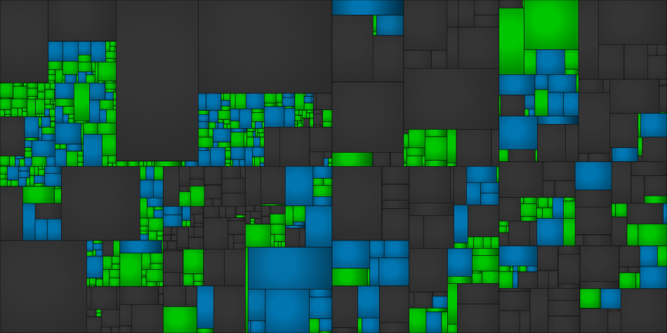

# Pokémon Black 2 and White 2

A work-in-progress decompilation of Pokémon Black 2 and White 2 (NDS, DSi-enhanced). The long-term goal is a PC port.

It builds the following ROMs:

| Version | File | SHA1 |
| --- | --- | --- |
| Black 2, USA/Europe (NDSi Enhanced) | `build/pokeblack2_us.nds` | `e51e6dfb8678a3d19dcd2a10691b96a569ca0abb` |
| White 2, USA/Europe (NDSi Enhanced) | `build/pokewhite2_us.nds` | `b5d7490be7b415b8f1e672a53e978a9cc667e56a` |

## Status

Both ROMs rebuild byte for byte from the same source tree, and everything not yet in C is still delinked code.
<!-- progress -->
11.85% of the code matches (454,108 of 3,832,636 bytes), with 6,346 of 41,675 functions, and 176 of 471 source files are complete.
<!-- /progress -->



Each rectangle is a source file, or a stretch of code not yet split into files, sized by its code: green when it
matches, and from grey to blue as it gets closer, as on [decomp.dev](https://decomp.dev). The trainer AI and field
scripts are built from source, see [Scripts](docs/scripts.md).

- 41,423 functions found by [dsd](https://github.com/AetiasHax/ds-decomp) in the ARM9, its 344 overlays, ITCM, DTCM, and the two TWL autoloads.
- 8,152 functions and 573 data symbols have real names, imported from [swan](docs/code-organization.md#names).
- The DSi-only LTD module in ARM9i is decompressed, analyzed and linked like the other modules. The ARM7i program is
  only extracted (decrypted) and rebuilt.

## Setup

1. Install [Rust](https://rustup.rs) for `cargo`, and clang and LLVM, whose `clang` and `llvm-objcopy` assemble the
   scripts and must be on the `PATH`.

2. Place your own dumps at `orig/baserom_b2_us.nds` and/or `orig/baserom_w2_us.nds`. They must match the SHA1s above.
   They are not included and will not be provided. `tools/scripts/verify_dsi_rom.py` checks a dump against the
   digests in its own header.

3. Configure and build. On first run, `configure.py` downloads [wibo](https://github.com/decompals/wibo), objdiff and
   the Metrowerks CodeWarrior tools, and builds dsd with DSi hybrid ROM support from pinned commits of these forks'
   `dsi-hybrid` branches (cloned into `tools/src/`) until the changes are upstreamed:
   - [`ds-rom`](https://github.com/fuddlesworth/ds-rom/tree/dsi-hybrid): DSi header, digests, modcrypt, TWL autoloads
     and DSi banners.
   - [`ds-decomp`](https://github.com/fuddlesworth/ds-decomp/tree/dsi-hybrid): TWL entrypoint, DS Protect and Thumb
     jump table fixes, and the ARM9i LTD module.

   ```sh
   python3 configure.py
   ninja
   ```

   `ninja` extracts each base ROM, delinks the code, links it with `mwldarm`, rebuilds the ROM and checks its SHA1.
   `configure.py` builds every version that has a base ROM, or the versions given as arguments. It rebuilds dsd when
   the pinned commits (`DSD_REPOS`) change. To work on dsd itself, build it from your own clones of both forks, side
   by side since `ds-decomp`'s `Cargo.toml` patches in `../ds-rom/lib`, and copy it to `tools/dsd`, or pass `--dsd`;
   a `tools/dsd` without `tools/dsd.rev` is never replaced.

4. Optionally, `python3 configure.py --bugfix` builds the ROMs with the game's bugs fixed, those marked with `BUGFIX`
   in the source. These ROMs don't match, so the build skips the checks. Only files marked `complete` are built from
   source, so fixes in the others don't apply yet. Run `configure.py` without it to go back to the matching build.

## Layout

| Path | Contents |
| --- | --- |
| `config/<version>/` | dsd configs: sections (`delinks.txt`), symbols and relocations for every module |
| `config/names.txt`, `config/fixes.txt` | Our own names and fixes to dsd's analysis, applied again after regenerating the configs |
| `src/ovNNN/` | Decompiled C of each overlay, such as `src/ov035/event_mapchange.c` |
| `src/gfl/`, `src/system/` | Decompiled C of the ARM9 main module, by library like the headers, such as `src/gfl/heap.c` |
| `lib/<name>/` | Libraries built apart from the game with their own compiler (`library.toml`), headers and sources, such as `lib/spl/` |
| `include/` | Headers shared by the C code, see [Code organization](docs/code-organization.md) |
| `data/` | Scripts assembled into the ROM's files, see [Scripts](docs/scripts.md) and [Field scripts](docs/scripts.md#field-scripts) |
| `include/asm/` | Macros for the scripts |
| `tools/scripts/` | Helper scripts, such as `romdiff.py` to compare two ROMs region by region |
| `docs/` | The documentation listed below |
| `CLAUDE.md`, `.claude/` | Rules, skills, agents and hooks for working on the decompilation with Claude Code |
| `extract/`, `build/` | Generated, never committed |

## Decompiling

Each of the game's original source files becomes one C file, written from the assembly until every function compiles
to the original bytes. Matching is checked per function with [objdiff](https://github.com/encounter/objdiff) and
`tools/scripts/compiler_probe.py`, and the ROMs are rebuilt and checked against their SHA1s by every `ninja`.
`ninja progress` prints how much of the game matches.

## Documentation

| Document | Contents |
| --- | --- |
| [Decompiling](docs/decompiling.md) | The workflow, the tools, and the compiler versions |
| [How MWCC compiles](docs/matching.md) | What makes the compiler's output match, by what a diff shows |
| [Code organization](docs/code-organization.md) | Source files, headers, names from swan, and the two versions |
| [Nonmatching functions](docs/nonmatching-functions.md) | Every function in C that doesn't match yet, and why |
| [Source files](docs/source-files.md) | Each overlay's original files, with the evidence for their names |
| [Scripts](docs/scripts.md) | The trainer AI and field scripts built from source, and their macros |
| [dsd configs and the ROM](docs/configs.md) | Fixing and regenerating the configs, the DSi's differences, known gaps |

## License

This project is licensed under the GNU General Public License v3.0, see [LICENSE](LICENSE). The symbol names imported
from swan are also GPL-3.0.

The repository contains no game code or assets. Building it requires your own dump of the game.
